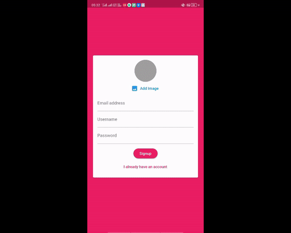

# Chat App with Flutter and Firebase

It's a realtime chat application using Firebase as a backend and it uses Firebase Cloud store for storing messages, Firebase Auth for email based login, Firebase Storage for storing prfile images and firebase messaging for push notification.
It was a project finished while following Max's Flutter course from Udemy.

# Packages Used
- cloud_firestore: ^0.13.5
- firebase_auth: ^0.16.0
- firebase_core: ^0.4.4 
- firebase_storage: ^3.1.5
- firebase_messaging: ^6.0.15
- image_picker: ^0.6.5+3
  

